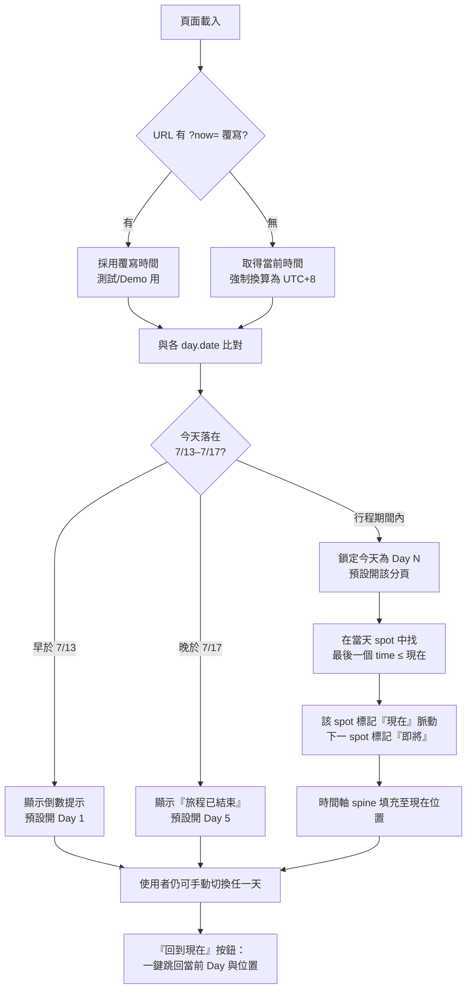
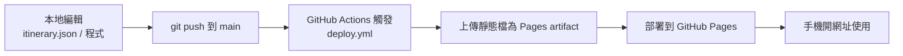

# 上海自由行網頁 — 設計文件

- **日期**：2026-06-18
- **專案路徑**：`/Users/sodalee/Desktop/china_trip`
- **行程來源**：`.claude/ref/上海5天4夜_優化行程表_v2_1.docx`（7/13–7/17，4 人，亞朵酒店）
- **目標**：手機優先的單頁靜態網頁，部署於 GitHub Pages，能依當下時間指出「現在該在哪個景點」，並可一鍵導航與保留行程修改空間。

---

## 1. 需求摘要（已確認規格）

| 項目 | 決策 |
| --- | --- |
| 資料存放 | 獨立 `data/itinerary.json`，程式碼負責渲染，改行程只動 JSON |
| 當前景點判斷 | 依**實際日期 + 時間**（以 UTC+8 計算，與裝置時區無關） |
| 高德導航 | 景點：`uri.amap.com/search` 關鍵字搜尋；交通串接：`uri.amap.com/navigation` 路線規劃，皆 `callnative=1` |
| 景點卡片 | 每景點獨立卡片，含**景點圖（先漸層佔位）+ 簡介（先佔位文字）** |
| 交通串接 | 兩景點間插入交通條，點擊跳轉高德路線規劃並帶入「即將前往」目的地 |
| 視覺風格 | 清爽現代・藍白卡片，手機優先 |
| 資訊分頁 | 加第 6 個「資訊」分頁（交通總覽 / 費用 / 行李清單 / 滴滴指南 / 注意事項） |
| 部署 | GitHub Actions workflow 自動部署 |

---

## 2. 系統架構

純靜態網站，資料與呈現分離。無 build 步驟、無框架依賴，可直接放上 GitHub Pages。

```
china_trip/
├─ index.html                     # 單頁殼層：標題列 + tab 導覽 + 內容容器
├─ css/
│  └─ style.css                   # 藍白卡片風格、時間軸 spine、三態樣式
├─ js/
│  ├─ app.js                      # 載入 JSON、tab 切換、渲染景點卡片與交通串接
│  ├─ now.js                      # UTC+8 當前時間、對應 Day、當前/即將時段、?now 覆寫
│  └─ amap.js                     # 高德 deeplink 組裝（search / navigation）
├─ data/
│  └─ itinerary.json              # ★ 唯一要編輯的檔：全部行程資料
├─ images/                        # 之後放景點真圖（先空）
├─ .nojekyll                      # 關閉 Jekyll，避免底線開頭檔被忽略
├─ .github/workflows/deploy.yml   # GitHub Actions 自動部署到 Pages
└─ README.md                      # 如何改行程、補圖、部署
```

**修改空間設計**：新增 / 調動景點 = 編輯 `itinerary.json`；補景點圖 = 丟檔到 `images/` 並在 JSON 填 `image` 路徑。程式碼完全不需更動。

---

## 3. 資料模型（itinerary.json）

每天的 `items` 由 `spot`（景點卡片）與 `transit`（交通串接）兩種節點**交錯**組成。

```jsonc
{
  "meta": {
    "title": "上海 5天4夜 · 自由行",
    "subtitle": "浪漫之都・美食之都・購物天堂",
    "dateRange": "7/13–7/17",
    "people": 4,
    "hotel": "南京東路亞朵酒店",
    "timezone": "+08:00"          // 行程時區，當前景點判斷一律以此計算
  },
  "days": [
    {
      "day": 1,
      "date": "2026-07-13",       // ISO 日期 → 用來比對「今天是第幾天」，不在程式 hardcode 月份
      "weekday": "一",
      "title": "抵達・南京路・外灘",
      "items": [
        {
          "type": "spot",
          "time": "15:00",
          "name": "南京東路站",
          "image": null,                       // null → 漸層佔位圖；之後填 "images/nanjing.jpg"
          "intro": "（簡介待補）出地鐵即是南京路步行街。",
          "map": { "keyword": "南京東路站", "city": "上海" }   // 選填，有才顯示「導航」鈕
        },
        {
          "type": "transit",
          "mode": "walk",                       // walk / taxi / metro / maglev
          "desc": "步行約 15 分鐘",
          "to": { "keyword": "外灘", "city": "上海" }          // 點擊→路線規劃目的地
        },
        {
          "type": "spot",
          "time": "20:30",
          "name": "外灘夜景",
          "image": null,
          "intro": "（簡介待補）黃浦江畔萬國建築博覽群夜景。",
          "map": { "keyword": "外灘", "city": "上海" }
        },
        { "type": "spot", "time": "14:30", "name": "完成入境", "image": null, "intro": "" }
        // 無 map 的純時間項目（入境/起床/返回飯店）→ 不顯示導航鈕
      ],
      "tips": "第一天以輕鬆為主，長途飛行後適度休息。",
      "transport": "飛機落地 → 磁浮+地鐵（約45分鐘，最省錢）。"
    }
  ],
  "info": {                                      // 第 6 個「資訊」分頁
    "transportTable": [ { "from": "...", "method": "...", "cost": "...", "note": "..." } ],
    "budget":        [ { "item": "...", "perPerson": "...", "note": "..." } ],
    "checklist":     [ "護照", "台胞證", "行動電源", "..." ],
    "didiGuide":     [ "出發前下載「滴滴出行」App", "..." ],
    "notes":         [ "白天高溫 33–38°C，務必防曬", "..." ],
    "apps":          [ { "name": "高德地圖", "use": "導航查地點" }, "..." ]
  }
}
```

**Schema 要點**

- `map` 為**選填**：只有真實地點才有，控制是否顯示「導航」鈕。
- `transit.to` 為交通串接的目的地，渲染為「即將前往：{name}」並組裝路線規劃連結。
- Day 對應「今天」用 `date`（ISO）比對，**不在程式判斷月份**，確保改期不破功。

---

## 4. 當前景點判斷邏輯



**關鍵設計**

- **時區**：一律以 `meta.timezone`（+08:00）計算，避免裝置時區設定造成高亮錯位。
- **測試覆寫**：支援 `?now=2026-07-14T10:30`。今天是 2026-06-18、距行程約一個月，覆寫機制讓核心功能當下即可肉眼驗收，而非等到上路。
- **三態**：每個 spot 為「已過 / 現在 / 即將」三態，以邊框、亮度與脈動點區分。
- **回到現在**：使用者手動瀏覽其他天後，可一鍵回到當前 Day 與當前時段。

---

## 5. 高德地圖 Deeplink

| 用途 | URL 形式 |
| --- | --- |
| 景點導航（關鍵字） | `https://uri.amap.com/search?keyword={name}&city={city}&src=shanghai-trip&callnative=1` |
| 交通路線規劃 | `https://uri.amap.com/navigation?to={keyword}&toname={name}&mode={car\|bus\|walk}&src=shanghai-trip&callnative=1` |

- `callnative=1`：手機優先喚起高德 App，**未安裝則自動 fallback 網頁版**（裸 `?keyword=` 只會開網頁）。
- mode 對應：`taxi → car`、`metro / maglev → bus`、`walk → walk`。
- ⚠️ 實機行為（喚起 App vs 開網頁）建議於 iOS / Android 真機各測一次；必要時改用 `marker` + 經緯度精準定位。

---

## 6. 視覺設計

**方向**：清爽現代・藍白卡片（手機優先）。品牌已定錨藍白，在此框架內以一個簽名元素建立記憶點。

**簽名元素 — 會呼吸的日程時間軸 spine**：每天左側一條垂直時間軸，填充至「現在」為止呈主藍；當前節點以暖橘脈動，交通段以虛線 + 交通圖示銜接。它把「我現在該在哪」變成可一眼讀懂的視覺。

**色票**

| 名稱 | Hex | 用途 |
| --- | --- | --- |
| 晨霧底 | `#F5F8FB` | 頁面背景 |
| 卡片白 | `#FFFFFF` | 卡片表面 |
| 主藍 | `#1565A0` | 主色、spine 已過段、tab active |
| 深藍 | `#0D3B5C` | 標題、深色文字 |
| 暖橘（破格） | `#FF8A3D` | **僅用於「現在/即將」狀態與脈動**，集中一處的視覺重點 |
| 墨色 | `#16293B` | 內文 |
| 次要灰 | `#7990A3` | 輔助文字、已過狀態降彩度 |
| 分隔線 | `#E2EAF1` | 邊框與分隔 |

**字體**：以系統字體堆疊為主（避免中國網路環境載不到 webfont）。時間以 tabular 數字大字呈現，作為時間軸的結構性錨點——時刻是計時行程裡最真實的資料，讓它成為視覺主角而非裝飾。

**版面（手機）**

```
┌──────────────────────────────┐
│ 上海 5天4夜 · 自由行            │ 標題列（sticky）
│ 7/13–7/17 · 4人 · 亞朵酒店      │
├──────────────────────────────┤
│ [D1][D2]●[D3][D4][D5][ℹ️] ⟲回到現在│ tab 列（sticky，●=今天）
├──────────────────────────────┤
│ Day 2 · 7/14 朱家角→豫園        │
│ ●─┐ ┌────────────────────┐   │
│ │  │ ▓▓ 漸層佔位圖 ▓▓ 08:30│   │ 景點卡片（已過）
│ │  │ 朱家角古鎮       [導航]│   │
│ │  └────────────────────┘   │
│ ┊  🚗 打滴約60分 ▸即將前往豫園  │ 交通串接（虛線，可點）
│ ◉─┐ ┌────────────────────┐   │ ◉=現在(脈動)
│ │  │ ▓▓ 漸層佔位圖 ▓▓ 14:30│◀現在│
│ │  │ 豫園            [導航]│   │
│ │  └────────────────────┘   │
└──────────────────────────────┘
```

**品質下限**：響應式至手機、鍵盤焦點可見、`prefers-reduced-motion` 時關閉脈動動畫。

---

## 7. 部署流程（GitHub Pages + Actions）



- `.nojekyll`：關閉 Jekyll 處理，避免底線開頭資源被忽略。
- `deploy.yml`：使用官方 `actions/upload-pages-artifact` + `actions/deploy-pages`，push 到 `main` 自動部署。
- ⚠️ **外部依賴**：需使用者的 GitHub 帳號建立 repo，並於 **Settings → Pages → Source 選 GitHub Actions**。此步驟需使用者操作或授權以 `gh` CLI 執行，建議框架完成後再進行。

---

## 8. 驗收方式

1. 本地以靜態伺服器開啟（`python3 -m http.server`）。
2. 以 `?now=2026-07-14T10:30` 覆寫 → 應自動切到 Day 2、朱家角後續時段高亮、spine 填充正確。
3. 切換各 tab、點「回到現在」、點景點「導航」與交通串接 → 連結格式正確。
4. 縮放至手機寬度檢查版面與焦點樣式。

---

## 9. 後續可擴充（保留空間，本次不做）

- 補景點真圖與完整簡介（丟 `images/` + 填 JSON）。
- 離線 PWA（Service Worker 快取）。
- 多語系、費用即時換算。
